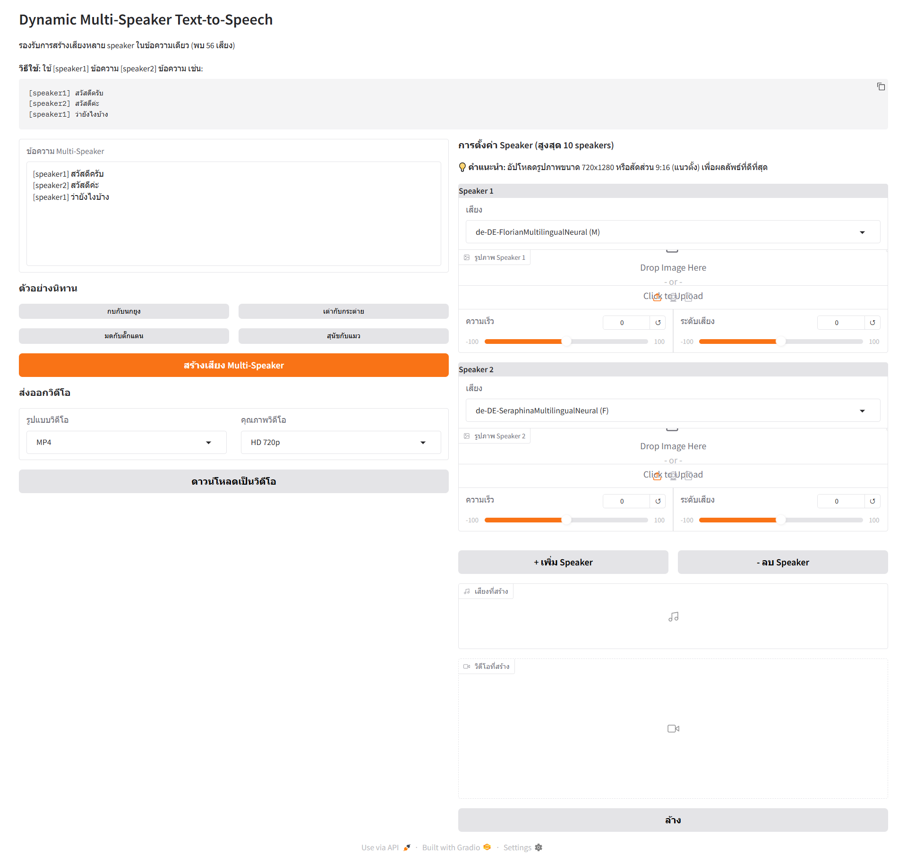

# edge-tts-webui

`edge-tts-webui` คือเวอร์ชันที่มีอินเทอร์เฟซแบบเว็บของ [edge-tts](https://github.com/rany2/edge-tts) โดยพัฒนาโดยใช้ `gradio`



## เวอร์ชัน

### v2.4 - Clean Output Organization
- จัดระเบียบไฟล์ output ในโฟลเดอร์ `outputs/`
- โครงสร้างโปรเจคสะอาดขึ้น
- ไฟล์ output ทั้งหมดถูกเก็บแยกออกมา
- อัปเดต .gitignore สำหรับโฟลเดอร์ outputs

### v2.3 - Perfect Audio-Video Sync
- แก้ไขปัญหาเสียงกับภาพไม่ตรงกัน
- สร้างเสียงและวิดีโอแยกกันแต่ละ segment แล้วรวมกัน
- Perfect Sync - เสียงกับภาพตรงกัน 100%
- ไม่ต้องสร้างเสียงก่อน - สร้างวิดีโอได้เลย
- ปรับปรุงการจัดการ error และ memory

### v2.2 - Portrait Video & Export Options
- เปลี่ยนวิดีโอเป็นแนวตั้ง (9:16) เหมาะสำหรับตัวละคร
- รองรับหลายรูปแบบวิดีโอ: MP4, AVI, MOV, WebM
- เลือกคุณภาพได้: HD 720p, Full HD 1080p, SD 480p
- ปรับปรุง UI ให้เรียบง่ายขึ้น
- เหมาะสำหรับ Instagram Stories, TikTok, YouTube Shorts

### v2.1 - Multi-Speaker Video Generation
- รองรับการสร้างวิดีโอจากเสียง + รูปภาพ
- ปรับขนาดรูปภาพอัตโนมัติเป็น HD 720p (1280x720)
- ตรวจสอบไฟล์เสียงก่อนสร้างวิดีโอ
- คำแนะนำขนาดรูปภาพสำหรับผู้ใช้
- ส่งออกเป็น MP4 คุณภาพ HD

### v2.0 - Multi-Speaker Dynamic TTS
- รองรับ Multi-Speaker Text-to-Speech สูงสุด 10 speakers
- ดึงรายการเสียงจาก edge-tts แบบ dynamic (56+ เสียง)
- ปรับแต่งเสียง ความเร็ว และระดับเสียงแยกกันสำหรับแต่ละ speaker
- เพิ่ม/ลบ speaker ได้แบบ dynamic
- ตรวจสอบความครบถ้วนของ speaker ก่อนสร้างเสียง
- ตัวอย่างนิทาน 4 เรื่อง
- รูปแบบการใช้งาน: `[speaker1] ข้อความ [speaker2] ข้อความ`

### v1.0 - Basic TTS
- Text-to-Speech พื้นฐาน
- เลือกเสียงและปรับแต่งได้

## การติดตั้ง

### ขั้นตอนที่ 1: Clone Repository
```bash
git clone https://github.com/your-username/edge-tts-webui.git
cd edge-tts-webui
```

### ขั้นตอนที่ 2: สร้าง Virtual Environment
```bash
python -m venv venv

# สำหรับ Windows
venv\Scripts\activate

# สำหรับ Linux/Mac
source venv/bin/activate
```

### ขั้นตอนที่ 3: ติดตั้ง Dependencies
```bash
pip install edge-tts gradio asyncio moviepy==1.0.3 opencv-python
```

### ขั้นตอนที่ 4 (ทางเลือก): ติดตั้ง FFmpeg
สำหรับการแปลงไฟล์เสียงรูปแบบอื่นๆ (WAV, AAC, OGG)

**Ubuntu/Debian:**
```bash
sudo apt update && sudo apt install ffmpeg
```

**Windows:**
- ดาวน์โหลดจาก [https://ffmpeg.org/download.html](https://ffmpeg.org/download.html)
- เพิ่ม FFmpeg ใน PATH

**macOS:**
```bash
brew install ffmpeg
```

## การใช้งาน

### เริ่มต้นใช้งาน
```bash
# เปิดใช้งาน virtual environment
source venv/bin/activate  # Linux/Mac
# หรือ venv\Scripts\activate  # Windows

# รันแอปพลิเคชัน
python app_multispeaker.py
```

### เข้าถึงเว็บแอป
เปิดเบราว์เซอร์และไปที่: **http://localhost:7860**

### วิธีการใช้งาน Multi-Speaker

#### 1. เขียนข้อความ
ใช้รูปแบบ `[speaker1] ข้อความ [speaker2] ข้อความ`

**ตัวอย่าง:**
```
[speaker1] สวัสดีครับ ผมชื่อโจ
[speaker2] สวัสดีค่ะ ดิฉันชื่อแอน
[speaker1] ยินดีที่ได้รู้จักครับ
[speaker2] เช่นกันค่ะ
```

#### 2. ตั้งค่า Speaker
- เลือกเสียงสำหรับแต่ละ speaker
- ปรับความเร็วและระดับเสียง
- อัปโหลดรูปภาพ (ถ้าต้องการสร้างวิดีโอ)

#### 3. สร้างเสียง
- กด **"สร้างเสียง Multi-Speaker"** เพื่อฟังตัวอย่าง

#### 4. สร้างวิดีโอ (ทางเลือก)
- เลือกรูปแบบวิดีโอ: MP4, AVI, MOV, WebM
- เลือกคุณภาพ: HD 720p, Full HD 1080p, SD 480p
- กด **"ดาวน์โหลดเป็นวิดีโอ"**

### ตัวอย่างนิทาน
แอปมีตัวอย่างนิทาน 4 เรื่องให้ทดลองใช้:
- กบกับนกยูง
- เต่ากับกระต่าย
- มดกับตั๊กแตน
- สุนัขกับแมว

## ฟีเจอร์หลัก

### 🎤 Multi-Speaker TTS
- รองรับสูงสุด 10 speakers
- เสียงไทยและ MultilingualNeural 56+ เสียง
- ปรับแต่งเสียง ความเร็ว ระดับเสียงแยกกัน
- เพิ่ม/ลบ speaker ได้แบบ dynamic

### 🎬 Video Generation
- วิดีโอแนวตั้ง (9:16) เหมาะสำหรับโซเชียล
- Perfect Sync - เสียงกับภาพตรงกัน 100%
- รองรับหลายรูปแบบ: MP4, AVI, MOV, WebM
- คุณภาพ HD 720p, Full HD 1080p, SD 480p

### 🖼️ Image Support
- อัปโหลดรูปภาพสำหรับแต่ละ speaker
- ปรับขนาดอัตโนมัติเป็น 720x1280 (9:16)
- รองรับ JPG, PNG, WebP

### ✨ Smart Features
- ตรวจสอบความครบถ้วนของ speaker
- ตัวอย่างนิทานพร้อมใช้งาน
- Dynamic voice loading
- Error handling และ validation

## คำแนะนำการใช้งาน

### สำหรับรูปภาพ
- **ขนาดแนะนำ**: 720x1280 pixels (แนวตั้ง)
- **สัดส่วน**: 9:16 เพื่อผลลัพธ์ที่ดีที่สุด
- **รูปแบบ**: JPG, PNG, WebP
- **เหมาะสำหรับ**: ตัวละคร, โซเชียลมีเดีย

### เทคนิคการเขียนบท
- ใช้ `[speaker1]`, `[speaker2]` เป็นต้น
- แต่ละ speaker ควรมีข้อความไม่เกิน 100 คำ
- เว้นบรรทัดใหม่ระหว่าง speaker ได้
- ใช้ภาษาไทยหรือภาษาอังกฤษ

### การเลือกเสียง
- **เสียงไทย**: Premwadee (หญิง), Niwat (ชาย), Achara (หญิง)
- **MultilingualNeural**: รองรับหลายภาษา เหมาะสำหรับข้อความผสม

## การแก้ไขปัญหา

### ปัญหาที่พบบ่อย

**1. ไม่สามารถติดตั้ง moviepy ได้**
```bash
pip install --upgrade pip
pip install moviepy==1.0.3
```

**2. Error เกี่ยวกับ ffmpeg**
- ติดตั้ง ffmpeg ตามขั้นตอนด้านบน
- หรือใช้แค่รูปแบบ MP3 (ไม่ต้องใช้ ffmpeg)

**3. วิดีโอไม่สามารถสร้างได้**
- ตรวจสอบว่าอัปโหลดรูปภาพแล้ว
- ลองลดคุณภาพวิดีโอเป็น SD 480p
- ตรวจสอบว่ามีพื้นที่ว่างเพียงพอ

**4. เสียงไม่ออก**
- ตรวจสอบการเชื่อมต่ออินเทอร์เน็ต
- ลองเปลี่ยนเสียง speaker
- รีสตาร์ทแอปพลิเคชัน

## ไฟล์ในโปรเจค

- `app_multispeaker.py` - แอปพลิเคชันหลัก (v2.4)
- `app_multispeaker_v2.4.py` - Backup v2.4
- `app_multispeaker_v2.3.py` - Backup v2.3
- `app_multispeaker_v2.2.py` - Backup v2.2
- `app_multispeaker_v2.1.py` - Backup v2.1
- `app_multispeaker_v2.0.py` - Backup v2.0
- `outputs/` - โฟลเดอร์เก็บไฟล์ output ทั้งหมด
- `README.md` - เอกสารนี้
- `LICENSE` - ใบอนุญาต
- `Snipaste.png` - ภาพตัวอย่าง
- `style.css` - ไฟล์ CSS

## การสนับสนุน

หากพบปัญหาหรือต้องการเสนอแนะ:
- เปิด Issue ใน GitHub Repository
- ตรวจสอบ README สำหรับการแก้ไขปัญหา
- อ่านเอกสาร edge-tts เพิ่มเติม

## ใบอนุญาต

โปรเจคนี้ใช้ใบอนุญาต MIT License - ดูรายละเอียดในไฟล์ [LICENSE](LICENSE)
# multi-speaker-tts
